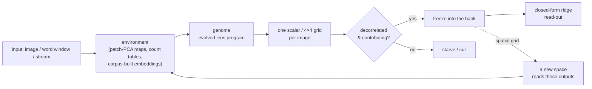
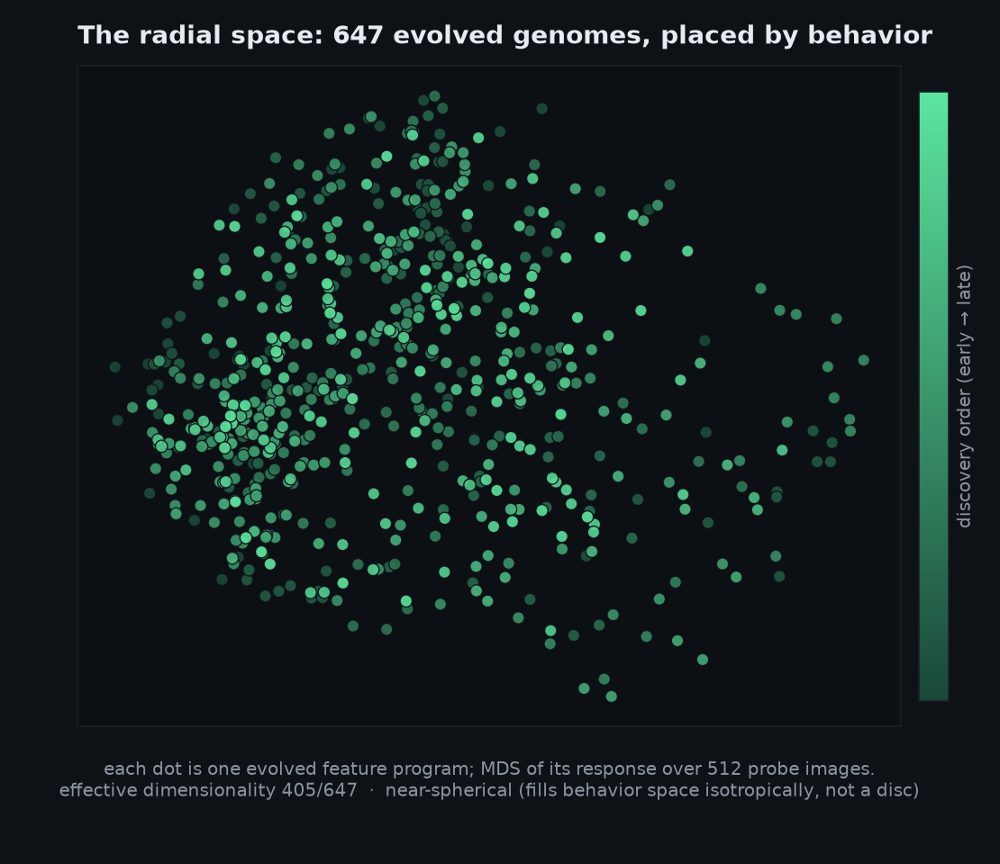
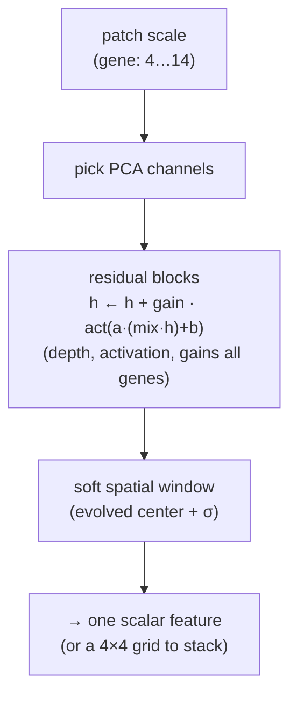
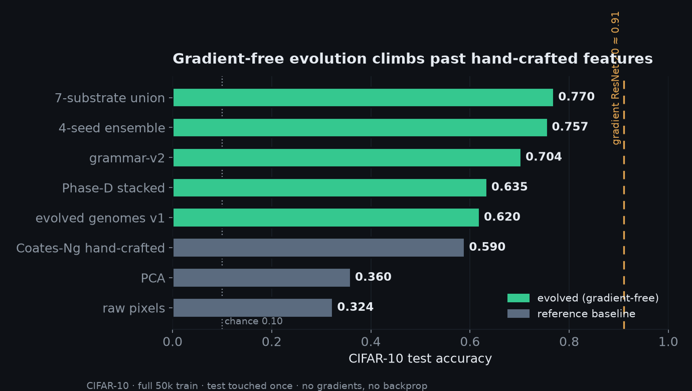

# GENREG: Gradient-Free Neuroevolution

**Evolve the features; don't design them.** Every model here is bred by
selection, energy homeostasis, and constraints, with *no gradients, no backprop,
no pretrained weights*. The guiding thesis:

> The fitness landscape is the only lever that matters. Don't design the
> solution; design conditions where the only stable attractor **is** the
> solution.

The centerpiece is the **radial space**: treat a dataset as an *environment*
that evolved **feature programs, genomes, that navigate it**. The environment carries
the statistics (patch-PCA maps, corpus count tables, embedding spaces built
from the data itself); evolution never re-learns what can be counted or
projected. It searches only for the **tiny relationships the environment
cannot express on its own** - and a closed-form ridge reads the result out.
No gradients, no backprop, anywhere, ever.

The same machinery runs vision (CIFAR/MNIST), language (a word-level LM with
topic and grammar specialists), animation, and streams - because nothing in it
is task-specific: genomes are programs over whatever environment they are
dropped into. The parameter ledger makes the thesis concrete: in the current
language system, **~12,000 evolved parameters steer a 138M-parameter
closed-form readout over 34M count-table keys** - evolution is 0.008% of the
mass and it is the part that decides.

**Composition over monoliths.** Capabilities are separate specialists, each
bred on one answerable question (continuation, topic, grammar), unioned at
decode time. A specialist that knows *only* whether word order is proper can
lift a generator it never trained with - measured, not hoped.

---

## The radial space

A **lens** is a deterministic feature program at a fixed address. Data flows
through lenses; it is the *relative* motion between the data and the lens that
manufactures signal diversity. Evolution doesn't build the embedding space. It
is handed one built from the data's own statistics (patch-PCA maps: *"the
features are the environment"*) and learns **one tiny relationship inside it**.



Each round breeds a population under **tournament selection + energy
homeostasis**, freezes the top *decorrelated, contributing* survivors as
columns, and reads them out with a **closed-form ridge**, no gradient anywhere.
When one space stops earning, its outputs become the data for a **new stacked
space**, so depth emerges from scarcity rather than a hyperparameter.

Fingerprinting 647 evolved genomes by their behavior (their response over a
fixed probe set) and projecting to a map shows what evolution actually built:
a near-spherical cloud that fills behavior space isotropically, with an
**effective dimensionality of 405 / 647** (≈9× more efficient than enumerating
a lens bank):



---

## The genome: an evolved feature program

Nothing about the feature is hand-designed; every structural property is a
**gene**. Evolution decides scale, which components to read, how deep to bend
them, how to combine them, and where in the image to look.



The human contribution is only the math primitives (an 8-function activation
catalog, a few combine ops and pooling stats) and the data statistics
(patch-PCA, built *from* the images). The **residual skip** `h ← h + gain·f`
is itself a gene: evolution rediscovers that residual depth is useful with zero
gradient signal (deep blocks survive selection; new blocks bootstrap as
near-no-ops and only "turn on" when the correction helps).

---

## Results

### CIFAR-10

Full 50k train, **test touched exactly once**, gradient-free throughout.
Non-evolved references in gray.



| Method | Test acc | Notes |
|--------|:--------:|-------|
| raw pixels | 0.324 | reference |
| PCA | 0.360 | reference |
| Coates-Ng hand-crafted (2048-dim) | 0.590 | the classic unsupervised-feature bar |
| **evolved genomes v1** | **0.620** | beats hand-crafted with ~650 scalar features |
| **Phase-D stacked** | **0.635** | outputs of one space feed a second |
| **grammar-v2** | **0.704** | every structural property a gene |
| **4-seed cross-seed ensemble** | **0.757** | diversity is nearly free |
| **7-substrate union** | **0.770** | best gradient-free result on this line |

Gradient ResNet-20 (backprop) sits at ≈0.91, a different regime. The story here
is not "we matched ResNet"; it is that **evolution, with no gradients, discovers
useful visual features and stacks them into a working hierarchy.**

A recent thread (`documentation/changelogs/CHANGELOG_RESNET.md`) built evolved
**residual** networks and showed gradient-free *stacking* beating a single deep
space (0.6638 vs 0.6593) once each space passes **spatial grids** (not scalars)
to the next and the base space is allowed to **mature**: the emergent-cap
stacking idea in `documentation/stacking.txt`, realized.

### Language (the /lm line)

A word-level LM built the same way: evolution composes on an environment of
n-gram continuation tables and corpus-built embeddings; a persistence-based
**topic specialist** (16/16 topic-hold) and a temporal **grammar specialist**
(pure word-order signal, anchor below chance) vote per decode step. The
specialist union **moved the fluency/topic frontier** (+1.4 nats at equal
hold) where single-model decode tuning could only trade along it. Full story:
`documentation/changelogs/CHANGELOG_LM.md`, modules 32-40 on the `/lm` page.

---

## The rules (what "gradient-free" buys and costs)

The full thesis and invariants live in
[`documentation/GENREG_RULES.md`](documentation/GENREG_RULES.md). The load-bearing ones:

- **No gradients, no backprop, no hybrid.** Evolution climbs staircases that
  gradients can't: step functions, integer ops, conditionals.
- **Soft fitness only** (mean log-prob, not `argmax==target`) so there is a
  gradient to climb; **multiplicative over additive** so it can't collapse to a
  mean-seeker.
- **Energy is homeostatic, not a reward.** It decides who survives, targeting
  3-15% starved per generation.
- **The landscape is designed, not given.** Every scalar proxy gets
  reward-hacked; anchor fitness to position-varying ground truth.
- **Component-first**: each piece clears a local *and* a downstream bar before
  it is frozen and composed.

---

## The avenues

The radial space and its genomes are the centerpiece; the vision lines
(CIFAR, ResNet, MNIST) are where exploring them produced the breakthroughs
and the laws. The same thesis - *evolve the
features under a designed landscape, never a gradient* - is pushed down a dozen
avenues, each its own page in the lab GUI. Every avenue keeps the house rules
(no gradients, soft fitness, energy homeostasis, test touched once) and logs to
its own changelog under `documentation/changelogs/`.

**Vision - evolved features on images**
- **CIFAR** (`/cifar`) - a vision model. Populations of tiny gradient-free feature
  genomes on CIFAR-10 pass hand-crafted features (0.711 single-substrate, 0.770
  as a multi-substrate union) with no backprop.
- **Radial** (`/radial`) - the engine behind it all: the radial space, the genome
  **microscope**, and the behavior map of what evolution actually built.
- **ResNet** (`/resnet`) - evolves *residual-block* genomes and shows gradient-free
  **stacking** beating a single deep space once each space hands spatial grids to
  the next (the "fat-R0" law).
- **MNIST** (`/mnist`) - the tabulatable control: seed-axis genomes reach 0.9909
  (past 99%), where evolution earns ~0 residual - proof of when the substrate,
  not selection, is doing the work.
- **X-Ray** (`/xray`) - the genome microscope: watch a solved genome act on
  real data live, pulling a tangled point cloud into clean class clusters,
  layer by layer. The genome working, made visible.

**Sequence - language & time series without gradients**
- **LM** (`/lm`) - gradient-free language modeling built as an append-only stack of
  modules: intent-first "diffusion" of words, and composed continuation banks
  (bigram → trigram → quad/skip) that currently reach ~69% of the classical cloze
  ceiling.
- **TSDB** (`/tsdb`) - the time-series arm of the sequence work.

**Evolve - generative & control substrates**
- **DiffEvo** (`/diff`) - denoising diffusion by neuroevolution: tiny per-pixel
  denoisers, one shared population per noise level, bred on minibatch fitness.
- **Animation** (`/animation`) - the attention line: *tracking the cursor* (where)
  unlocks *recognizing shape* (what), plus a temporal **persistence operator** that
  accumulates a detector's response over a stream.
- **PURE** (`/pure`) - the control baseline: a plain GA with none of GENREG's bells
  and whistles, the yardstick every added mechanism is measured against; also a
  node-graph model assembler where each constraint is a wired-in node.
- **Humanoid** (`/humanoid`) - evolved humanoid figure/motion sandbox.

**Media & Net - where the evolved genomes become content**
- **Video** (`/video`) - a slideshow / explainer studio: build image-based decks
  (poses + charts + captions), paste a full script and split it into slides, and
  render to MP4 through an ffmpeg pipeline.
- **Images** (`/images`) - the reverse tab: image or video → a prompt, via
  captioning plus CLIP-ranked medium/style/lighting tags.
- **I2** (`/i2`) - a peer-to-peer latent-vector content network in which an evolved
  VAE is the "genome" and a canvas browser is the client, with a YouTube-style
  social layer.

**Workspace - the shared instruments**
- **Runs** (`/runs`) - every project's training runs recorded in one comparable
  layout; the shared bench for reading and comparing results across avenues.
- **Progress** (`/progress`) - a dashboard over this changelog: per-project activity
  over time, measurable completion toward each avenue's goal, and an
  impact-weighted timeline that separates real advancement from raw velocity.
- **Build / Plan / History / Docs** (`/`, `/plan`, `/history`, `/docs`) - the build
  console with real in-page terminals, planning, history, and the rules/findings
  docs.

---

## The lab (how to run it)

The engine ships inside a small Flask app that hosts the projects behind one
browser GUI (live game boards, a genome **microscope**, PO-metrics, and real
in-page terminals). Radial-space work lives on the `/radial` and `/resnet`
pages; every training run is captured on `/runs`.

```powershell
cd $HOME\Documents\GENREG
pip install -r requirements.txt     # first time
python app.py                       # http://127.0.0.1:5000
```

CUDA is used when available (the CIFAR line was farmed on RTX 4080 / H100), CPU
otherwise. Binds to `127.0.0.1` only.

| Path | What it is |
|------|-----------|
| `radial/` | the gradient-free core: evo engines, radial stack, seed-stack (CIFAR/MNIST) |
| `lm/` | the language line: word LM, cranks, topic + grammar specialists, live inference |
| `anim/`, `mm/`, `resnet/` | animation/attention, multimodal fusion, residual stacking lines |
| `services/`, `cli/` | Flask page services; standalone tools (job runner, daemons) |
| `genreg_train/` | training services (`evolang.py`, `diffuse_service.py`, `runstore.py`) |
| `documentation/` | rules, findings, per-project changelogs |
| `app.py`, `templates/`, `static/` | the Flask app + browser GUI |
| `docs/images/` | the charts in this README (regenerable from `radial_data/`) |

Licensed AGPL-3.0.
